<!-- Generated by scripts/gen-doc-graphs.ts - do not edit by hand.
     Run `pnpm run gen-doc-graphs` to regenerate. -->

# TUI Agent App Composition

The TUI surface combines the shared CLI base with its surface overlay and full-screen terminal package.

```mermaid
flowchart LR
  cfg["apps/cli/config<br/>cordis.yml"]
  plugin_tui_timer["timer<br/>@cordisjs/plugin-timer"]
  cfg --> plugin_tui_timer
  plugin_tui_hmr["hmr<br/>@cordisjs/plugin-hmr"]
  cfg --> plugin_tui_hmr
  plugin_tui_repository_plugins["repository-plugins<br/>@deepseek-ai/dsh-repository-plugin"]
  cfg --> plugin_tui_repository_plugins
  plugin_tui_llm["llm<br/>@deepseek-ai/dsh-llm"]
  cfg --> plugin_tui_llm
  plugin_tui_session["session<br/>@deepseek-ai/dsh-session"]
  cfg --> plugin_tui_session
  plugin_tui_session_title["session-title<br/>@deepseek-ai/dsh-session-title"]
  cfg --> plugin_tui_session_title
  plugin_tui_session_title_llm["session-title-llm<br/>@deepseek-ai/dsh-session-title-first-message-llm"]
  cfg --> plugin_tui_session_title_llm
  plugin_tui_user_interaction["user-interaction<br/>@deepseek-ai/dsh-user-interaction"]
  cfg --> plugin_tui_user_interaction
  plugin_tui_agent["agent<br/>@deepseek-ai/dsh-agent"]
  cfg --> plugin_tui_agent
  plugin_tui_tasks["tasks<br/>@deepseek-ai/dsh-tasks-local"]
  cfg --> plugin_tui_tasks
  plugin_tui_llm_retry["llm-retry<br/>@deepseek-ai/dsh-llm-retry"]
  cfg --> plugin_tui_llm_retry
  plugin_tui_settings["settings<br/>@deepseek-ai/dsh-settings-local"]
  cfg --> plugin_tui_settings
  plugin_tui_credentials["credentials<br/>@deepseek-ai/dsh-credentials-local"]
  cfg --> plugin_tui_credentials
  plugin_tui_llm_pi_ai["llm-pi-ai<br/>@deepseek-ai/dsh-llm-pi-ai"]
  cfg --> plugin_tui_llm_pi_ai
  plugin_tui_session_persistence_jsonl["session-persistence-jsonl<br/>@deepseek-ai/dsh-session-persistence-jsonl"]
  cfg --> plugin_tui_session_persistence_jsonl
  plugin_tui_session_query_sqlite["session-query-sqlite<br/>@deepseek-ai/dsh-session-query-sqlite"]
  cfg --> plugin_tui_session_query_sqlite
  plugin_tui_telemetry_otel["telemetry-otel<br/>@deepseek-ai/dsh-session-telemetry-otel"]
  cfg --> plugin_tui_telemetry_otel
  plugin_tui_subprocess["subprocess<br/>@deepseek-ai/dsh-subprocess-local"]
  cfg --> plugin_tui_subprocess
  plugin_tui_sandbox["sandbox<br/>@deepseek-ai/dsh-sandbox-local"]
  cfg --> plugin_tui_sandbox
  plugin_tui_sandbox_policy["sandbox-policy<br/>@deepseek-ai/dsh-sandbox-policy"]
  cfg --> plugin_tui_sandbox_policy
  plugin_tui_bash_sandbox["bash-sandbox<br/>@deepseek-ai/dsh-bash-sandbox"]
  cfg --> plugin_tui_bash_sandbox
  plugin_tui_approval["approval<br/>@deepseek-ai/dsh-user-approval"]
  cfg --> plugin_tui_approval
  plugin_tui_permission["permission<br/>@deepseek-ai/dsh-permission"]
  cfg --> plugin_tui_permission
  plugin_tui_tool_bash["tool-bash<br/>@deepseek-ai/dsh-tool-bash"]
  cfg --> plugin_tui_tool_bash
  plugin_tui_tool_tasks["tool-tasks<br/>@deepseek-ai/dsh-tool-tasks"]
  cfg --> plugin_tui_tool_tasks
  plugin_tui_fs_policy["fs-policy<br/>@deepseek-ai/dsh-fs-policy"]
  cfg --> plugin_tui_fs_policy
  plugin_tui_tool_fs["tool-fs<br/>@deepseek-ai/dsh-tool-fs"]
  cfg --> plugin_tui_tool_fs
  plugin_tui_tool_fs_search["tool-fs-search<br/>@deepseek-ai/dsh-tool-fs-search"]
  cfg --> plugin_tui_tool_fs_search
  plugin_tui_workspace_context["workspace-context<br/>@deepseek-ai/dsh-workspace-context"]
  cfg --> plugin_tui_workspace_context
  plugin_tui_skill["skill<br/>@deepseek-ai/dsh-skill"]
  cfg --> plugin_tui_skill
  plugin_tui_skill_local["skill-local<br/>@deepseek-ai/dsh-skill-local"]
  cfg --> plugin_tui_skill_local
  plugin_tui_tool_skill["tool-skill<br/>@deepseek-ai/dsh-tool-skill"]
  cfg --> plugin_tui_tool_skill
  plugin_tui_commands["commands<br/>@deepseek-ai/dsh-commands"]
  cfg --> plugin_tui_commands
  plugin_tui_goal["goal<br/>@deepseek-ai/dsh-goal"]
  cfg --> plugin_tui_goal
  plugin_tui_goal_session["goal-session<br/>@deepseek-ai/dsh-goal-session"]
  cfg --> plugin_tui_goal_session
  plugin_tui_command_goal["command-goal<br/>@deepseek-ai/dsh-command-goal"]
  cfg --> plugin_tui_command_goal
  plugin_tui_plan_mode["plan-mode<br/>@deepseek-ai/dsh-plan-mode"]
  cfg --> plugin_tui_plan_mode
  plugin_tui_token_meter["token-meter<br/>@deepseek-ai/dsh-token-meter"]
  cfg --> plugin_tui_token_meter
  plugin_tui_compact_basic["compact-basic<br/>@deepseek-ai/dsh-compact-basic"]
  cfg --> plugin_tui_compact_basic
  plugin_tui_command_compact["command-compact<br/>@deepseek-ai/dsh-command-compact"]
  cfg --> plugin_tui_command_compact
  plugin_tui_subagent["subagent<br/>@deepseek-ai/dsh-subagent"]
  cfg --> plugin_tui_subagent
  plugin_tui_subagent_spawn["subagent-spawn<br/>@deepseek-ai/dsh-subagent-spawn"]
  cfg --> plugin_tui_subagent_spawn
  plugin_tui_subagent_fork["subagent-fork<br/>@deepseek-ai/dsh-subagent-fork"]
  cfg --> plugin_tui_subagent_fork
  plugin_tui_tool_subagent_control["tool-subagent-control<br/>@deepseek-ai/dsh-tool-subagent-control"]
  cfg --> plugin_tui_tool_subagent_control
  plugin_tui_tool_subagent_list_agents["tool-subagent-list-agents<br/>@deepseek-ai/dsh-tool-subagent-control/list-agents"]
  cfg --> plugin_tui_tool_subagent_list_agents
  plugin_tui_tool_subagent["tool-subagent<br/>@deepseek-ai/dsh-tool-subagent"]
  cfg --> plugin_tui_tool_subagent
  plugin_tui_tool_subagent_fork["tool-subagent-fork<br/>@deepseek-ai/dsh-tool-subagent"]
  cfg --> plugin_tui_tool_subagent_fork
  plugin_tui_tool_subagent_report["tool-subagent-report<br/>@deepseek-ai/dsh-tool-subagent-report"]
  cfg --> plugin_tui_tool_subagent_report
  plugin_tui_workflow_workerthread["workflow-workerthread<br/>@deepseek-ai/dsh-workflow-workerthread"]
  cfg --> plugin_tui_workflow_workerthread
  plugin_tui_tool_workflow["tool-workflow<br/>@deepseek-ai/dsh-tool-workflow"]
  cfg --> plugin_tui_tool_workflow
  plugin_tui_timeout_policy["timeout-policy<br/>@deepseek-ai/dsh-timeout-policy"]
  cfg --> plugin_tui_timeout_policy
  plugin_tui_spill_local["spill-local<br/>@deepseek-ai/dsh-spill-local"]
  cfg --> plugin_tui_spill_local
  plugin_tui_spill_policy["spill-policy<br/>@deepseek-ai/dsh-spill-policy"]
  cfg --> plugin_tui_spill_policy
  plugin_tui_session_checkpoint_policy["session-checkpoint-policy<br/>@deepseek-ai/dsh-session-checkpoint-policy"]
  cfg --> plugin_tui_session_checkpoint_policy
  plugin_tui_tool_result_prune["tool-result-prune<br/>@deepseek-ai/dsh-compact-tool-result-prune"]
  cfg --> plugin_tui_tool_result_prune
  plugin_tui_tool_todo["tool-todo<br/>@deepseek-ai/dsh-tool-todo"]
  cfg --> plugin_tui_tool_todo
  plugin_tui_tool_goal["tool-goal<br/>@deepseek-ai/dsh-tool-goal"]
  cfg --> plugin_tui_tool_goal
  plugin_tui_tool_ralph["tool-ralph<br/>@deepseek-ai/dsh-tool-ralph"]
  cfg --> plugin_tui_tool_ralph
  plugin_tui_tool_str_replace_editor["tool-str-replace-editor<br/>@deepseek-ai/dsh-tool-str-replace-editor"]
  cfg --> plugin_tui_tool_str_replace_editor
  plugin_tui_repeat_tool_guard["repeat-tool-guard<br/>@deepseek-ai/dsh-repeat-tool-guard"]
  cfg --> plugin_tui_repeat_tool_guard
  plugin_tui_web["web<br/>@deepseek-ai/dsh-web"]
  cfg --> plugin_tui_web
  plugin_tui_web_search_deepseek["web-search-deepseek<br/>@deepseek-ai/dsh-web-search-deepseek"]
  cfg --> plugin_tui_web_search_deepseek
  plugin_tui_tool_web["tool-web<br/>@deepseek-ai/dsh-tool-web"]
  cfg --> plugin_tui_tool_web
  plugin_tui_tools["tools<br/>@deepseek-ai/dsh-tools"]
  cfg --> plugin_tui_tools
  plugin_tui_system_prompt["system-prompt<br/>@deepseek-ai/dsh-system-prompt"]
  cfg --> plugin_tui_system_prompt
  plugin_tui_agent_loop["agent-loop<br/>@deepseek-ai/dsh-agent-loop"]
  cfg --> plugin_tui_agent_loop
  plugin_tui_fs_sandbox["fs-sandbox<br/>@deepseek-ai/dsh-fs-sandbox"]
  cfg --> plugin_tui_fs_sandbox
  plugin_tui_llm_deepseek["llm-deepseek<br/>@deepseek-ai/dsh-llm-deepseek"]
  cfg --> plugin_tui_llm_deepseek
```

| Plugin id | Package / module |
| --- | --- |
| `timer` | `@cordisjs/plugin-timer` |
| `hmr` | `@cordisjs/plugin-hmr` |
| `repository-plugins` | `@deepseek-ai/dsh-repository-plugin` |
| `llm` | `@deepseek-ai/dsh-llm` |
| `session` | `@deepseek-ai/dsh-session` |
| `session-title` | `@deepseek-ai/dsh-session-title` |
| `session-title-llm` | `@deepseek-ai/dsh-session-title-first-message-llm` |
| `user-interaction` | `@deepseek-ai/dsh-user-interaction` |
| `agent` | `@deepseek-ai/dsh-agent` |
| `tasks` | `@deepseek-ai/dsh-tasks-local` |
| `llm-retry` | `@deepseek-ai/dsh-llm-retry` |
| `settings` | `@deepseek-ai/dsh-settings-local` |
| `credentials` | `@deepseek-ai/dsh-credentials-local` |
| `llm-pi-ai` | `@deepseek-ai/dsh-llm-pi-ai` |
| `session-persistence-jsonl` | `@deepseek-ai/dsh-session-persistence-jsonl` |
| `session-query-sqlite` | `@deepseek-ai/dsh-session-query-sqlite` |
| `telemetry-otel` | `@deepseek-ai/dsh-session-telemetry-otel` |
| `subprocess` | `@deepseek-ai/dsh-subprocess-local` |
| `sandbox` | `@deepseek-ai/dsh-sandbox-local` |
| `sandbox-policy` | `@deepseek-ai/dsh-sandbox-policy` |
| `bash-sandbox` | `@deepseek-ai/dsh-bash-sandbox` |
| `approval` | `@deepseek-ai/dsh-user-approval` |
| `permission` | `@deepseek-ai/dsh-permission` |
| `tool-bash` | `@deepseek-ai/dsh-tool-bash` |
| `tool-tasks` | `@deepseek-ai/dsh-tool-tasks` |
| `fs-policy` | `@deepseek-ai/dsh-fs-policy` |
| `tool-fs` | `@deepseek-ai/dsh-tool-fs` |
| `tool-fs-search` | `@deepseek-ai/dsh-tool-fs-search` |
| `workspace-context` | `@deepseek-ai/dsh-workspace-context` |
| `skill` | `@deepseek-ai/dsh-skill` |
| `skill-local` | `@deepseek-ai/dsh-skill-local` |
| `tool-skill` | `@deepseek-ai/dsh-tool-skill` |
| `commands` | `@deepseek-ai/dsh-commands` |
| `goal` | `@deepseek-ai/dsh-goal` |
| `goal-session` | `@deepseek-ai/dsh-goal-session` |
| `command-goal` | `@deepseek-ai/dsh-command-goal` |
| `plan-mode` | `@deepseek-ai/dsh-plan-mode` |
| `token-meter` | `@deepseek-ai/dsh-token-meter` |
| `compact-basic` | `@deepseek-ai/dsh-compact-basic` |
| `command-compact` | `@deepseek-ai/dsh-command-compact` |
| `subagent` | `@deepseek-ai/dsh-subagent` |
| `subagent-spawn` | `@deepseek-ai/dsh-subagent-spawn` |
| `subagent-fork` | `@deepseek-ai/dsh-subagent-fork` |
| `tool-subagent-control` | `@deepseek-ai/dsh-tool-subagent-control` |
| `tool-subagent-list-agents` | `@deepseek-ai/dsh-tool-subagent-control/list-agents` |
| `tool-subagent` | `@deepseek-ai/dsh-tool-subagent` |
| `tool-subagent-fork` | `@deepseek-ai/dsh-tool-subagent` |
| `tool-subagent-report` | `@deepseek-ai/dsh-tool-subagent-report` |
| `workflow-workerthread` | `@deepseek-ai/dsh-workflow-workerthread` |
| `tool-workflow` | `@deepseek-ai/dsh-tool-workflow` |
| `timeout-policy` | `@deepseek-ai/dsh-timeout-policy` |
| `spill-local` | `@deepseek-ai/dsh-spill-local` |
| `spill-policy` | `@deepseek-ai/dsh-spill-policy` |
| `session-checkpoint-policy` | `@deepseek-ai/dsh-session-checkpoint-policy` |
| `tool-result-prune` | `@deepseek-ai/dsh-compact-tool-result-prune` |
| `tool-todo` | `@deepseek-ai/dsh-tool-todo` |
| `tool-goal` | `@deepseek-ai/dsh-tool-goal` |
| `tool-ralph` | `@deepseek-ai/dsh-tool-ralph` |
| `tool-str-replace-editor` | `@deepseek-ai/dsh-tool-str-replace-editor` |
| `repeat-tool-guard` | `@deepseek-ai/dsh-repeat-tool-guard` |
| `web` | `@deepseek-ai/dsh-web` |
| `web-search-deepseek` | `@deepseek-ai/dsh-web-search-deepseek` |
| `tool-web` | `@deepseek-ai/dsh-tool-web` |
| `tools` | `@deepseek-ai/dsh-tools` |
| `system-prompt` | `@deepseek-ai/dsh-system-prompt` |
| `agent-loop` | `@deepseek-ai/dsh-agent-loop` |
| `fs-sandbox` | `@deepseek-ai/dsh-fs-sandbox` |
| `llm-deepseek` | `@deepseek-ai/dsh-llm-deepseek` |

Source config: [`apps/cli/config/base.cordis.yml`](config/base.cordis.yml).

Maintenance mode: hybrid: the leaf plugin list is parsed from its `cordis.yml`; app package expansion is curated from package source.
