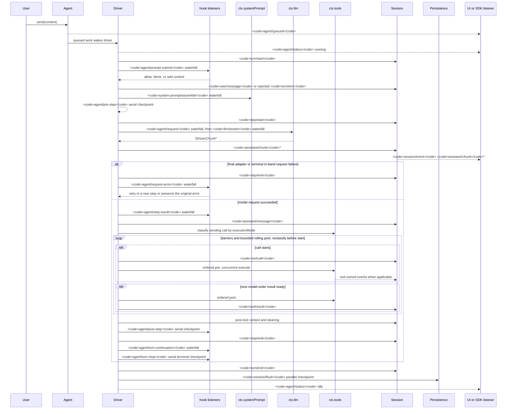

<!-- Generated by scripts/gen-doc-graphs.ts - do not edit by hand.
     Run `pnpm run gen-doc-graphs` to regenerate. -->

# Agent Turn And Step Lifecycle

This sequence is the visual companion to [architecture.md](architecture.md#loop-lifecycle-session--turn--step). It keeps durable replay facts on `session/event` and live control/status on `agent/*`.

The `assistant/message` edge records every successful provider call, including content-less and `max-tokens` finishes. Empty content stays out of derived history while the durable anchor retains usage and exact chunk provenance, including an explicit empty source set.

`dsh-compact-basic` uses `agent/post-step` for pressure after those durable facts and `agent/request-error` only for canonical context overflow. Recovery compacts between the closed failed step and a fresh retry step, and returns retry only when the surface replacement generation advances; otherwise the original request error remains authoritative.

SDK users that need replayable transcript data should consume `session/event`; `agent/*` is the live coordination surface for queue/status, prompt interception, request shaping, steering, continuation, and errors.

Maintenance mode: curated Mermaid sequence; exact event signatures live in the generated Cordis catalog.
