<!-- Generated by scripts/gen-doc-graphs.ts - do not edit by hand.
     Run `pnpm run gen-doc-graphs` to regenerate. -->

# Capability Seams And Core Services

A service can be a core spine service, a swappable capability seam, or a bundle/composition point. The graph shows the package that owns the service declaration, known implementation packages, and packages that consume the service directly.

```mermaid
flowchart LR
  pkg_llm["llm"]
  svc_llm["ctx.llm<br/>LLM adapter registry"]
  pkg_llm_deepseek["llm-deepseek"]
  pkg_llm_pi_ai["llm-pi-ai"]
  pkg_llm_replay["llm-replay"]
  pkg_agent_loop["agent-loop"]
  pkg_compact_basic["compact-basic"]
  pkg_token_meter["token-meter"]
  svc_tokenMeter["ctx.tokenMeter<br/>Replay token measurement"]
  pkg_compact_tool_result_prune["compact-tool-result-prune"]
  svc_toolResultPrune["ctx.toolResultPrune<br/>Model-free tool-result pruning"]
  pkg_session["session"]
  svc_sessions["ctx.sessions<br/>In-memory session store"]
  pkg_agent["agent"]
  pkg_session_persistence["session-persistence"]
  pkg_session_query["session-query"]
  pkg_session_query_sqlite["session-query-sqlite"]
  pkg_subagent_inprocess["subagent-inprocess"]
  pkg_invariants["invariants"]
  svc_invariants["ctx.invariants<br/>Package-owned invariant registry"]
  pkg_scope["scope"]
  pkg_typert_registry["typert-registry"]
  svc_typert["ctx.typert<br/>Runtime type registry"]
  pkg_typert_loader["typert-loader"]
  pkg_api_gateway["api-gateway"]
  svc_typertGateway["ctx.typertGateway<br/>TypeRT Host invocation gateway"]
  svc_sessionPersistence["ctx.sessionPersistence<br/>Durable session persistence seam"]
  pkg_session_persistence_jsonl["session-persistence-jsonl"]
  pkg_session_persistence_sqlite["session-persistence-sqlite"]
  pkg_tool_bash["tool-bash"]
  pkg_hooks_claude["hooks-claude"]
  pkg_hooks_codex["hooks-codex"]
  pkg_settings["settings"]
  svc_settings["ctx.settings<br/>User-settings seam"]
  pkg_settings_local["settings-local"]
  pkg_apiproxy["apiproxy"]
  pkg_credentials["credentials"]
  svc_credentials["ctx.credentials<br/>Credential seam"]
  pkg_credentials_local["credentials-local"]
  pkg_session_telemetry["session-telemetry"]
  svc_telemetry["ctx.telemetry<br/>Session telemetry seam"]
  pkg_session_telemetry_otel["session-telemetry-otel"]
  pkg_storage["storage"]
  svc_storage["ctx.storage<br/>Non-session storage hub"]
  pkg_storage_json["storage-json"]
  pkg_storage_sqlite["storage-sqlite"]
  pkg_storage_domain["storage-domain"]
  svc_storageDomain["ctx.storageDomain<br/>Domain data facility"]
  pkg_workspace["workspace"]
  svc_workspace["ctx.workspace<br/>Workspace entity registry"]
  svc_sessionQuery["ctx.sessionQuery<br/>Session reads, traces, filters, and search"]
  pkg_session_reference["session-reference"]
  pkg_tool_session_query["tool-session-query"]
  svc_sessionReferences["ctx.sessionReferences<br/>Cross-session snapshot preparation"]
  pkg_session_title["session-title"]
  svc_sessionTitle["ctx.sessionTitle<br/>Log-backed session titles"]
  pkg_session_title_first_message_llm["session-title-first-message-llm"]
  pkg_session_title_all_messages_llm["session-title-all-messages-llm"]
  pkg_system_prompt["system-prompt"]
  svc_systemPrompt["ctx.systemPrompt<br/>System prompt assembly registry"]
  pkg_tools["tools"]
  pkg_tool_fs["tool-fs"]
  pkg_tool_pty["tool-pty"]
  pkg_tool_web["tool-web"]
  svc_tools["ctx.tools<br/>Tool registry and guarded execution pipeline"]
  pkg_tool_ask_user["tool-ask-user"]
  pkg_tool_cordis["tool-cordis"]
  pkg_tool_skill["tool-skill"]
  pkg_tool_subagent["tool-subagent"]
  pkg_tool_todo["tool-todo"]
  pkg_user_interaction["user-interaction"]
  svc_userInteraction["ctx.userInteraction<br/>Human question/answer seam"]
  pkg_plan_mode["plan-mode"]
  svc_planMode["ctx.planMode<br/>Plan collaboration state"]
  pkg_agent_presets["agent-presets"]
  svc_agentPresets["ctx.agentPresets<br/>Per-session agent composition"]
  pkg_commands["commands"]
  svc_commands["ctx.commands<br/>Human command registry"]
  pkg_session_projection["session-projection"]
  svc_sessionProjections["ctx.sessionProjections<br/>Session projection units"]
  pkg_host_apiproxy["host-apiproxy"]
  pkg_session_projection_cache["session-projection-cache"]
  svc_sessionProjectionCache["ctx.sessionProjectionCache<br/>Persisted projection cache"]
  pkg_skill["skill"]
  svc_skills["ctx.skills<br/>Skill provider registry"]
  pkg_skill_badge["skill-badge"]
  pkg_skill_local["skill-local"]
  svc_agents["ctx.agents<br/>Agent service"]
  pkg_acp["acp"]
  svc_agentLoop["ctx.agentLoop<br/>Concrete loop driver"]
  pkg_agent_spine_demo["agent-spine-demo"]
  pkg_goal["goal"]
  svc_goals["ctx.goals<br/>Same-session goal domain"]
  pkg_e2b["e2b"]
  svc_e2b["ctx.e2b<br/>E2B sandbox lifecycle owner"]
  pkg_fs_e2b["fs-e2b"]
  pkg_subprocess_e2b["subprocess-e2b"]
  pkg_subprocess["subprocess"]
  svc_subprocess["ctx.subprocess<br/>Subprocess seam"]
  pkg_subprocess_local["subprocess-local"]
  pkg_bash_local["bash-local"]
  pkg_bash_sandbox["bash-sandbox"]
  pkg_pty_local["pty-local"]
  pkg_lsp_local["lsp-local"]
  pkg_subagent_acp["subagent-acp"]
  pkg_subagent_codex["subagent-codex"]
  pkg_subagent_claude_code["subagent-claude-code"]
  pkg_bash["bash"]
  svc_bash["ctx.bash<br/>Bash executor seam"]
  pkg_pwsh_local["pwsh-local"]
  pkg_tool_pwsh["tool-pwsh"]
  pkg_bash_env["bash-env"]
  svc_bashEnv["ctx.bashEnv<br/>Managed bash environment registry"]
  pkg_pty["pty"]
  svc_pty["ctx.pty<br/>Persistent PTY session registry"]
  pkg_sandbox["sandbox"]
  svc_sandbox["ctx.sandbox<br/>Process-sandbox seam"]
  pkg_sandbox_local["sandbox-local"]
  pkg_sandbox_policy["sandbox-policy"]
  svc_sandboxPolicy["ctx.sandboxPolicy<br/>Sandbox policy home"]
  pkg_fs_sandbox["fs-sandbox"]
  pkg_approval["approval"]
  svc_approval["ctx.approval<br/>Approval seam"]
  pkg_permission["permission"]
  svc_permission["ctx.permission<br/>Permission presets"]
  pkg_code_runtime["code-runtime"]
  svc_codeRuntime["ctx.codeRuntime<br/>Code-execution seam"]
  pkg_code_runtime_worker["code-runtime-worker"]
  pkg_fs["fs"]
  svc_fs["ctx.fs<br/>Filesystem provider seam"]
  pkg_fs_local["fs-local"]
  pkg_fs_policy["fs-policy"]
  pkg_compact["compact"]
  svc_compact["ctx.compact<br/>Compaction seam"]
  pkg_subagent["subagent"]
  svc_subagents["ctx.subagents<br/>Subagent provider and continuation service"]
  pkg_subagent_spawn["subagent-spawn"]
  pkg_subagent_fork["subagent-fork"]
  pkg_subagent_dsh_sdk["subagent-dsh-sdk"]
  pkg_tool_subagent_control["tool-subagent-control"]
  pkg_tool_ralph["tool-ralph"]
  pkg_tasks["tasks"]
  svc_tasks["ctx.tasks<br/>Background task registry"]
  pkg_tasks_local["tasks-local"]
  pkg_tool_tasks["tool-tasks"]
  pkg_web["web"]
  svc_web["ctx.web<br/>Web access provider registry"]
  pkg_web_search_exa["web-search-exa"]
  pkg_web_search_perplexity["web-search-perplexity"]
  pkg_web_search_deepseek["web-search-deepseek"]
  pkg_web_fetch_local["web-fetch-local"]
  pkg_spill["spill"]
  svc_spillStore["ctx.spillStore<br/>Spill storage seam"]
  pkg_spill_local["spill-local"]
  pkg_spill_policy["spill-policy"]
  pkg_directory_picker["directory-picker"]
  svc_directoryPicker["ctx.directoryPicker<br/>Workspace-directory picking seam"]
  pkg_directory_picker_native["directory-picker-native"]
  pkg_directory_picker_browse["directory-picker-browse"]
  pkg_webserver["webserver"]
  svc_httpServer["ctx.httpServer<br/>HTTP route registration"]
  pkg_connection["connection"]
  pkg_modules["modules"]
  pkg_hmr["hmr"]
  svc_clientModuleHost["ctx.clientModuleHost<br/>Client plugin graph host"]
  pkg_workflow["workflow"]
  svc_workflows["ctx.workflows<br/>Workflow script engine"]
  pkg_workflow_workerthread["workflow-workerthread"]
  pkg_tool_workflow["tool-workflow"]
  pkg_acp --> svc_approval
  pkg_agent --> svc_agents
  pkg_agent_loop --> svc_agentLoop
  pkg_agent_presets --> svc_agentPresets
  pkg_api_gateway --> svc_typertGateway
  pkg_approval --> svc_approval
  pkg_bash --> svc_bash
  pkg_bash_env --> svc_bashEnv
  pkg_bash_local --> svc_bash
  pkg_bash_sandbox --> svc_bash
  pkg_code_runtime --> svc_codeRuntime
  pkg_code_runtime_worker --> svc_codeRuntime
  pkg_commands --> svc_commands
  pkg_compact --> svc_compact
  pkg_compact_basic --> svc_compact
  pkg_compact_tool_result_prune --> svc_toolResultPrune
  pkg_credentials --> svc_credentials
  pkg_credentials_local --> svc_credentials
  pkg_directory_picker --> svc_directoryPicker
  pkg_directory_picker_browse --> svc_directoryPicker
  pkg_directory_picker_native --> svc_directoryPicker
  pkg_e2b --> svc_e2b
  pkg_fs --> svc_fs
  pkg_fs_e2b --> svc_fs
  pkg_fs_local --> svc_fs
  pkg_fs_sandbox --> svc_fs
  pkg_goal --> svc_goals
  pkg_invariants --> svc_invariants
  pkg_llm --> svc_llm
  pkg_llm_deepseek --> svc_llm
  pkg_llm_pi_ai --> svc_llm
  pkg_llm_replay --> svc_llm
  pkg_modules --> svc_clientModuleHost
  pkg_permission --> svc_permission
  pkg_plan_mode --> svc_planMode
  pkg_pty --> svc_pty
  pkg_pty_local --> svc_pty
  pkg_pwsh_local --> svc_bash
  pkg_sandbox --> svc_sandbox
  pkg_sandbox_local --> svc_sandbox
  pkg_sandbox_policy --> svc_sandboxPolicy
  pkg_session --> svc_sessions
  pkg_session_persistence --> svc_sessionPersistence
  pkg_session_persistence_jsonl --> svc_sessionPersistence
  pkg_session_persistence_sqlite --> svc_sessionPersistence
  pkg_session_projection --> svc_sessionProjections
  pkg_session_projection_cache --> svc_sessionProjectionCache
  pkg_session_query --> svc_sessionQuery
  pkg_session_query_sqlite --> svc_sessionQuery
  pkg_session_reference --> svc_sessionReferences
  pkg_session_telemetry --> svc_telemetry
  pkg_session_telemetry_otel --> svc_telemetry
  pkg_session_title --> svc_sessionTitle
  pkg_session_title_all_messages_llm --> svc_sessionTitle
  pkg_session_title_first_message_llm --> svc_sessionTitle
  pkg_settings --> svc_settings
  pkg_settings_local --> svc_settings
  pkg_skill --> svc_skills
  pkg_skill_badge --> svc_skills
  pkg_skill_local --> svc_skills
  pkg_spill --> svc_spillStore
  pkg_spill_local --> svc_spillStore
  pkg_storage --> svc_storage
  pkg_storage_domain --> svc_storageDomain
  pkg_storage_json --> svc_storage
  pkg_storage_sqlite --> svc_storage
  pkg_subagent --> svc_subagents
  pkg_subagent_acp --> svc_subagents
  pkg_subagent_claude_code --> svc_subagents
  pkg_subagent_codex --> svc_subagents
  pkg_subagent_dsh_sdk --> svc_subagents
  pkg_subagent_fork --> svc_subagents
  pkg_subagent_spawn --> svc_subagents
  pkg_subprocess --> svc_subprocess
  pkg_subprocess_e2b --> svc_subprocess
  pkg_subprocess_local --> svc_subprocess
  pkg_system_prompt --> svc_systemPrompt
  pkg_tasks --> svc_tasks
  pkg_tasks_local --> svc_tasks
  pkg_token_meter --> svc_tokenMeter
  pkg_tools --> svc_tools
  pkg_typert_registry --> svc_typert
  pkg_user_interaction --> svc_userInteraction
  pkg_web --> svc_web
  pkg_web_fetch_local --> svc_web
  pkg_web_search_deepseek --> svc_web
  pkg_web_search_exa --> svc_web
  pkg_web_search_perplexity --> svc_web
  pkg_webserver --> svc_httpServer
  pkg_workflow --> svc_workflows
  pkg_workflow_workerthread --> svc_workflows
  pkg_workspace --> svc_workspace
  svc_agentLoop --> pkg_agent_spine_demo
  svc_agents --> pkg_acp
  svc_agents --> pkg_agent_loop
  svc_agents --> pkg_subagent_inprocess
  svc_approval --> pkg_tool_bash
  svc_approval --> pkg_tools
  svc_bash --> pkg_hooks_claude
  svc_bash --> pkg_hooks_codex
  svc_bash --> pkg_tool_bash
  svc_bash --> pkg_tool_pwsh
  svc_bashEnv --> pkg_tool_bash
  svc_bashEnv --> pkg_tool_pwsh
  svc_clientModuleHost --> pkg_hmr
  svc_codeRuntime --> pkg_tools
  svc_compact --> pkg_compact_basic
  svc_credentials --> pkg_apiproxy
  svc_credentials --> pkg_llm_deepseek
  svc_credentials --> pkg_llm_pi_ai
  svc_directoryPicker --> pkg_apiproxy
  svc_e2b --> pkg_fs_e2b
  svc_e2b --> pkg_subprocess_e2b
  svc_fs --> pkg_tool_fs
  svc_httpServer --> pkg_connection
  svc_httpServer --> pkg_hmr
  svc_httpServer --> pkg_modules
  svc_invariants --> pkg_agent
  svc_invariants --> pkg_agent_loop
  svc_invariants --> pkg_scope
  svc_invariants --> pkg_session
  svc_llm --> pkg_agent_loop
  svc_llm --> pkg_compact_basic
  svc_pty --> pkg_tool_pty
  svc_sandbox --> pkg_bash_sandbox
  svc_sandbox --> pkg_pty_local
  svc_sandboxPolicy --> pkg_bash_sandbox
  svc_sandboxPolicy --> pkg_fs_sandbox
  svc_sandboxPolicy --> pkg_pty_local
  svc_sessionPersistence --> pkg_agent_loop
  svc_sessionPersistence --> pkg_hooks_claude
  svc_sessionPersistence --> pkg_hooks_codex
  svc_sessionPersistence --> pkg_session_query
  svc_sessionPersistence --> pkg_session_query_sqlite
  svc_sessionPersistence --> pkg_tool_bash
  svc_sessionProjectionCache --> pkg_host_apiproxy
  svc_sessionProjections --> pkg_host_apiproxy
  svc_sessionProjections --> pkg_session_title
  svc_sessionProjections --> pkg_tool_todo
  svc_sessionQuery --> pkg_session_reference
  svc_sessionQuery --> pkg_tool_session_query
  svc_sessions --> pkg_agent
  svc_sessions --> pkg_agent_loop
  svc_sessions --> pkg_invariants
  svc_sessions --> pkg_session_persistence
  svc_sessions --> pkg_session_query
  svc_sessions --> pkg_session_query_sqlite
  svc_sessions --> pkg_subagent_inprocess
  svc_settings --> pkg_apiproxy
  svc_settings --> pkg_llm_deepseek
  svc_settings --> pkg_llm_pi_ai
  svc_skills --> pkg_tool_skill
  svc_spillStore --> pkg_spill_policy
  svc_storage --> pkg_storage_domain
  svc_storageDomain --> pkg_workspace
  svc_subagents --> pkg_tool_ralph
  svc_subagents --> pkg_tool_subagent
  svc_subagents --> pkg_tool_subagent_control
  svc_subprocess --> pkg_bash_local
  svc_subprocess --> pkg_bash_sandbox
  svc_subprocess --> pkg_lsp_local
  svc_subprocess --> pkg_pty_local
  svc_subprocess --> pkg_subagent_acp
  svc_subprocess --> pkg_subagent_claude_code
  svc_subprocess --> pkg_subagent_codex
  svc_systemPrompt --> pkg_agent_loop
  svc_systemPrompt --> pkg_tool_fs
  svc_systemPrompt --> pkg_tool_pty
  svc_systemPrompt --> pkg_tool_web
  svc_systemPrompt --> pkg_tools
  svc_tasks --> pkg_tool_bash
  svc_tasks --> pkg_tool_pty
  svc_tasks --> pkg_tool_subagent
  svc_tasks --> pkg_tool_tasks
  svc_tokenMeter --> pkg_compact_basic
  svc_toolResultPrune --> pkg_compact_basic
  svc_tools --> pkg_agent_loop
  svc_tools --> pkg_tool_ask_user
  svc_tools --> pkg_tool_bash
  svc_tools --> pkg_tool_cordis
  svc_tools --> pkg_tool_fs
  svc_tools --> pkg_tool_pty
  svc_tools --> pkg_tool_skill
  svc_tools --> pkg_tool_subagent
  svc_tools --> pkg_tool_todo
  svc_tools --> pkg_tool_web
  svc_typert --> pkg_api_gateway
  svc_typert --> pkg_typert_loader
  svc_userInteraction --> pkg_tool_ask_user
  svc_web --> pkg_tool_web
  svc_workflows --> pkg_tool_ralph
  svc_workflows --> pkg_tool_workflow
  svc_workspace --> pkg_apiproxy
  svc_fs -. event gate .-> pkg_fs_policy
```

| ctx key | Role | Owner | Implementations | Direct consumers | Companion plugins | Note |
| --- | --- | --- | --- | --- | --- | --- |
| `ctx.llm` | `seam` | [`llm`](../packages/llm/llm) | [`llm-deepseek`](../packages/llm/llm-deepseek), [`llm-pi-ai`](../packages/llm/llm-pi-ai), [`llm-replay`](../packages/support/llm-replay) | [`agent-loop`](../packages/core/agent-loop), [`compact-basic`](../packages/compact/compact-basic) | - | Adapters register provider implementations; the loop and compaction call the provider-neutral stream service. |
| `ctx.tokenMeter` | `core` | [`token-meter`](../packages/llm/token-meter) | - | [`compact-basic`](../packages/compact/compact-basic) | - | Owns isolated per-session replay folds; pressure consumers share immutable revisioned measurements. |
| `ctx.toolResultPrune` | `core` | [`compact-tool-result-prune`](../packages/compact/compact-tool-result-prune) | - | [`compact-basic`](../packages/compact/compact-basic) | - | Rewrites oversized current tool results through replayable single-node surface replacements before summary compaction. |
| `ctx.sessions` | `core` | [`session`](../packages/core/session) | - | [`agent-loop`](../packages/core/agent-loop), [`agent`](../packages/core/agent), [`session-persistence`](../packages/session/session-persistence), [`session-query`](../packages/session-query/session-query), [`session-query-sqlite`](../packages/session-query/session-query-sqlite), [`subagent-inprocess`](../packages/subagent/subagent-inprocess), [`invariants`](../packages/support/invariants) | - | Owns append-only Session instances and emits the durable session event feed. |
| `ctx.invariants` | `core` | [`invariants`](../packages/support/invariants) | - | [`session`](../packages/core/session), [`agent`](../packages/core/agent), [`scope`](../packages/core/scope), [`agent-loop`](../packages/core/agent-loop) | - | Companion subpaths register owner-local checks; the service owns selection, uniqueness, child fibers, and package-attributed failures. |
| `ctx.typert` | `core` | [`typert-registry`](../packages/typert/registry) | - | [`typert-loader`](../packages/typert/loader), [`api-gateway`](../packages/api/gateway) | - | Plugins register live zod contributions directly or through dsh-typert-loader; the API gateway consumes invocation descriptors and providers, while other runtime consumers query schemas and reflection metadata at their own edges. |
| `ctx.typertGateway` | `core` | [`api-gateway`](../packages/api/gateway) | - | - | - | Associates generated Remote descriptors with live Cordis services, resolves registered identities, and exposes unary calls through the shared Connection RPC carrier. |
| `ctx.sessionPersistence` | `seam` | [`session-persistence`](../packages/session/session-persistence) | [`session-persistence-jsonl`](../packages/session/session-persistence-jsonl), [`session-persistence-sqlite`](../packages/session/session-persistence-sqlite) | [`agent-loop`](../packages/core/agent-loop), [`tool-bash`](../packages/bash/tool-bash), [`hooks-claude`](../packages/hooks/hooks-claude), [`hooks-codex`](../packages/hooks/hooks-codex), [`session-query`](../packages/session-query/session-query), [`session-query-sqlite`](../packages/session-query/session-query-sqlite) | - | Backends persist the same SessionEvent vocabulary; apps choose a backend at composition time. |
| `ctx.settings` | `seam` | [`settings`](../packages/settings/settings) | [`settings-local`](../packages/settings/settings-local) | [`llm-deepseek`](../packages/llm/llm-deepseek), [`llm-pi-ai`](../packages/llm/llm-pi-ai), `apiproxy` | - | Plugins register namespace schemas and resolve layered values; providers store the raw document. The LLM adapters register their entry config as the composition base under the user section; the web gateway serves redacted layered descriptors and writes the user layer. |
| `ctx.credentials` | `seam` | [`credentials`](../packages/credentials/credentials) | [`credentials-local`](../packages/credentials/credentials-local) | [`llm-deepseek`](../packages/llm/llm-deepseek), [`llm-pi-ai`](../packages/llm/llm-pi-ai), `apiproxy` | - | Configuration carries references to secrets; providers own the values. Consumers resolve per operation, so a rotated credential reaches the very next request; the web gateway exposes value-free views and write-only storage. |
| `ctx.telemetry` | `seam` | [`session-telemetry`](../packages/session/session-telemetry) | [`session-telemetry-otel`](../packages/session/session-telemetry-otel) | - | - | The seam captures, redacts, and hands session records to one backend; nothing else consumes the service — its output leaves the process. |
| `ctx.storage` | `seam` | [`storage`](../packages/storage/storage) | [`storage-json`](../packages/storage/storage-json), [`storage-sqlite`](../packages/storage/storage-sqlite) | [`storage-domain`](../packages/storage/storage-domain) | - | Backends register side by side under names; data forms (domain first) mount on the hub and translate typed operations into opaque KV-unit primitives. |
| `ctx.storageDomain` | `core` | [`storage-domain`](../packages/storage/storage-domain) | - | [`workspace`](../packages/workspace/workspace) | - | Waits for every configured backend, then publishes the domain form as one lifecycle-bound service for typed durable state. |
| `ctx.workspace` | `core` | [`workspace`](../packages/workspace/workspace) | - | `apiproxy` | - | Owns WorkspaceId-branded records over the domain facility; stable sessionIds accounts drive Host RPC and GUI projections. |
| `ctx.sessionQuery` | `seam` | [`session-query`](../packages/session-query/session-query) | [`session-query-sqlite`](../packages/session-query/session-query-sqlite) | [`session-reference`](../packages/context/session-reference), [`tool-session-query`](../packages/session-query/tool-session-query) | - | The interface supplies exact reads, filters, and traces; its concrete backend adds full-text reconciliation, ranking, snippets, and cursor generations, while the model consumer owns workspace authority and cursor-free rendering. |
| `ctx.sessionReferences` | `core` | [`session-reference`](../packages/context/session-reference) | - | - | - | Projects bounded current-surface conversation snapshots into durable untrusted message context; host adapters own mention syntax. |
| `ctx.sessionTitle` | `seam` | [`session-title`](../packages/session/session-title) | [`session-title-first-message-llm`](../packages/session/session-title-first-message-llm), [`session-title-all-messages-llm`](../packages/session/session-title-all-messages-llm) | - | - | Owns the deterministic fallback, latest-title fold, and sole optional asynchronous provider registration. |
| `ctx.systemPrompt` | `core` | [`system-prompt`](../packages/core/system-prompt) | - | [`agent-loop`](../packages/core/agent-loop), [`tools`](../packages/core/tools), [`tool-fs`](../packages/fs/tool-fs), [`tool-pty`](../packages/pty/tool-pty), [`tool-web`](../packages/web/tool-web) | - | Collects prompt sections and model-facing tool schemas for each step. |
| `ctx.tools` | `core` | [`tools`](../packages/core/tools) | - | [`agent-loop`](../packages/core/agent-loop), [`tool-ask-user`](../packages/interaction/tool-ask-user), [`tool-bash`](../packages/bash/tool-bash), [`tool-cordis`](../packages/self-modification/tool-cordis), [`tool-fs`](../packages/fs/tool-fs), [`tool-pty`](../packages/pty/tool-pty), [`tool-skill`](../packages/skill/tool-skill), [`tool-subagent`](../packages/subagent/tool-subagent), [`tool-todo`](../packages/todo/tool-todo), [`tool-web`](../packages/web/tool-web) | - | Registers capabilities, owns Code Mode transport, and routes calls through pre-policy, monotonic guards, around dispatch, post-policy, and final-result observation. |
| `ctx.userInteraction` | `seam` | [`user-interaction`](../packages/interaction/user-interaction) | - | [`tool-ask-user`](../packages/interaction/tool-ask-user) | - | UI front doors provide the active human-answer provider; tool-ask-user pauses a tool call on the provider-neutral ask() promise. |
| `ctx.planMode` | `core` | [`plan-mode`](../packages/plan/plan-mode) | - | - | - | Folds logged plan/mode state, flushes user selections at turn boundaries, renders deployment-owned guidance, registers /plan, and keeps the plan-exit schema stable across transitions. |
| `ctx.agentPresets` | `core` | [`agent-presets`](../packages/preset/agent-presets) | - | - | - | Discovers preset directories over trusted and user-authored roots and mounts one preset cordis.yml under an agent scope during creation, rejecting a row that never activates or that publishes into the root service realm. |
| `ctx.commands` | `core` | [`commands`](../packages/interaction/commands) | - | - | - | Plugins register direct human commands without sending invocations to the model. |
| `ctx.sessionProjections` | `core` | [`session-projection`](../packages/session/session-projection) | - | [`tool-todo`](../packages/todo/tool-todo), [`session-title`](../packages/session/session-title), [`host-apiproxy`](../packages/host/apiproxy) | - | Domains register state-driven fold units; the eager drive keeps per-session watermark states and api-proxy serves baselines and pushes changed values. |
| `ctx.sessionProjectionCache` | `core` | [`session-projection-cache`](../packages/session/session-projection-cache) | - | [`host-apiproxy`](../packages/host/apiproxy) | - | Durably checkpoints projection unit states per session (throttled + turn/end/detach mandatory points) and serves the cold-read ladder: cache row + persistence tail replay, so listings never load full logs. |
| `ctx.skills` | `seam` | [`skill`](../packages/skill/skill) | [`skill-badge`](../packages/skill/skill-badge), [`skill-local`](../packages/skill/skill-local) | [`tool-skill`](../packages/skill/tool-skill) | - | Merges provider skill catalogs; tool-skill renders the session-prefix catalog and loads complete skill bodies. |
| `ctx.agents` | `core` | [`agent`](../packages/core/agent) | - | [`agent-loop`](../packages/core/agent-loop), [`acp`](../packages/acp/acp), [`subagent-inprocess`](../packages/subagent/subagent-inprocess) | - | Owns live Agent handles, the create/resume factory seam, and process-local initiator propagation. |
| `ctx.agentLoop` | `bundle` | [`agent-loop`](../packages/core/agent-loop) | - | [`agent-spine-demo`](../packages/examples/agent-spine-demo) | - | The one concrete loop plugin; extension packages depend on dsh-agent events and services, not on this package. |
| `ctx.goals` | `core` | [`goal`](../packages/goal/goal) | - | - | - | Folds revisioned objective state from the session log and keeps live continuation activation process-local. |
| `ctx.e2b` | `core` | [`e2b`](../packages/e2b/e2b) | - | [`fs-e2b`](../packages/e2b/fs-e2b), [`subprocess-e2b`](../packages/e2b/subprocess-e2b) | - | Owns one shared E2B SDK handle, remote working directory, and final sandbox disposition so both fundamental E2B providers inhabit the same Linux runtime. |
| `ctx.subprocess` | `seam` | [`subprocess`](../packages/subprocess/subprocess) | [`subprocess-local`](../packages/subprocess/subprocess-local), [`subprocess-e2b`](../packages/e2b/subprocess-e2b) | [`bash-local`](../packages/bash/bash-local), [`bash-sandbox`](../packages/bash/bash-sandbox), [`pty-local`](../packages/pty/pty-local), [`lsp-local`](../packages/lsp/lsp-local), [`subagent-acp`](../packages/subagent/subagent-acp), [`subagent-codex`](../packages/subagent/subagent-codex), [`subagent-claude-code`](../packages/subagent/subagent-claude-code) | - | The bash executors, the PTY shell backend, the LSP host, and the out-of-process ACP, Codex, and Claude Code subagent backends spawn through ctx.subprocess; the service owns process coordinates, tree/session lifetime, stdio dispositions, terminal mechanics, and kill escalation. |
| `ctx.bash` | `seam` | [`bash`](../packages/bash/bash) | [`bash-local`](../packages/bash/bash-local), [`bash-sandbox`](../packages/bash/bash-sandbox), [`pwsh-local`](../packages/bash/pwsh-local) | [`tool-bash`](../packages/bash/tool-bash), [`tool-pwsh`](../packages/bash/tool-pwsh), [`hooks-claude`](../packages/hooks/hooks-claude), [`hooks-codex`](../packages/hooks/hooks-codex) | - | The model-facing shell tools and hook bridges consume this seam; sandboxed, remote, or PowerShell executors replace bash-local without touching them. |
| `ctx.bashEnv` | `core` | [`bash-env`](../packages/bash/bash-env) | - | [`tool-bash`](../packages/bash/tool-bash), [`tool-pwsh`](../packages/bash/tool-pwsh) | - | Plugins declare effect-scoped DSH_* facts; each shell tool collects one trusted snapshot per execution and its executor rebuilds the namespace. |
| `ctx.pty` | `seam` | [`pty`](../packages/pty/pty) | [`pty-local`](../packages/pty/pty-local) | [`tool-pty`](../packages/pty/tool-pty) | - | The registry owns exact-Agent session identity and cleanup; backends own terminal mechanics, while tool-pty exposes the owner-scoped model surface. |
| `ctx.sandbox` | `seam` | [`sandbox`](../packages/sandbox/sandbox) | [`sandbox-local`](../packages/sandbox/sandbox-local) | [`bash-sandbox`](../packages/bash/bash-sandbox), [`pty-local`](../packages/pty/pty-local) | - | Consumers hand over the exact argv they are about to spawn; same-world backends wrap it under a per-call policy and report enforcement. |
| `ctx.sandboxPolicy` | `core` | [`sandbox-policy`](../packages/sandbox/sandbox-policy) | - | [`bash-sandbox`](../packages/bash/bash-sandbox), [`fs-sandbox`](../packages/fs/fs-sandbox), [`pty-local`](../packages/pty/pty-local) | - | The one home for the deployment default mode + workspace root; only the sandboxed executor and provider read the service (the tool layers use the pure `sandbox/mode` fold it also exports). Both enforcing families read it so bash and fs cannot confine to different roots. |
| `ctx.approval` | `seam` | `approval` | [`acp`](../packages/acp/acp) | [`tools`](../packages/core/tools), [`tool-bash`](../packages/bash/tool-bash) | - | One-shot permission decisions dispatched over the `approval/request` waterfall; answerers are listeners (the ACP bridge for its own agents), absence fails closed to `unavailable`. |
| `ctx.permission` | `core` | [`permission`](../packages/interaction/permission) | - | - | - | User-facing preset table (`workspace-write`/`danger-full-access`) bundling the sandbox-mode and approval-policy knobs; a switch writes one `permission/preset` event through to both knob events. |
| `ctx.codeRuntime` | `seam` | [`code-runtime`](../packages/code-runtime/code-runtime) | [`code-runtime-worker`](../packages/code-runtime/code-runtime-worker) | [`tools`](../packages/core/tools) | - | Runs one model-written program against host-provided async bindings; backends differ by substrate and language (the tool registry consumes it for Code Mode). |
| `ctx.fs` | `seam` | [`fs`](../packages/fs/fs) | [`fs-local`](../packages/fs/fs-local), [`fs-sandbox`](../packages/fs/fs-sandbox), [`fs-e2b`](../packages/e2b/fs-e2b) | [`tool-fs`](../packages/fs/tool-fs) | [`fs-policy`](../packages/fs/fs-policy) | tool-fs executes read/write/edit through ctx.fs; fs-sandbox fences mutations by the shared sandbox mode; fs-policy contributes observed-state checks through the fs/* event gate. |
| `ctx.compact` | `seam` | [`compact`](../packages/compact/compact) | [`compact-basic`](../packages/compact/compact-basic) | [`compact-basic`](../packages/compact/compact-basic) | - | The basic backend consumes post-step pressure and request-error recovery events; a model-facing compact tool remains deferred. |
| `ctx.subagents` | `seam` | [`subagent`](../packages/subagent/subagent) | [`subagent-spawn`](../packages/subagent/subagent-spawn), [`subagent-fork`](../packages/subagent/subagent-fork), [`subagent-acp`](../packages/subagent/subagent-acp), [`subagent-codex`](../packages/subagent/subagent-codex), [`subagent-claude-code`](../packages/subagent/subagent-claude-code), [`subagent-dsh-sdk`](../packages/subagent/subagent-dsh-sdk) | [`tool-subagent`](../packages/subagent/tool-subagent), [`tool-subagent-control`](../packages/subagent/tool-subagent-control), [`tool-ralph`](../packages/workflow/tool-ralph) | - | Providers implement transports; the service also owns optional Activation-based continuation orchestration, tool-subagent selects one-shot or continuable delegation, tool-subagent-control delivers follow-ups, and tool-ralph requires one fresh structured-output route. |
| `ctx.tasks` | `seam` | [`tasks`](../packages/tasks/tasks) | [`tasks-local`](../packages/tasks/tasks-local) | [`tool-bash`](../packages/bash/tool-bash), [`tool-pty`](../packages/pty/tool-pty), [`tool-subagent`](../packages/subagent/tool-subagent), [`tool-tasks`](../packages/tasks/tool-tasks) | - | Producers (background bash, PTY sends, and subagent delegations) register running work; tool-tasks is the model-facing control surface that reads, lists, and kills it; tasks-local is the process-local registry. |
| `ctx.web` | `seam` | [`web`](../packages/web/web) | [`web-search-exa`](../packages/web/web-search-exa), [`web-search-perplexity`](../packages/web/web-search-perplexity), [`web-search-deepseek`](../packages/web/web-search-deepseek), [`web-fetch-local`](../packages/web/web-fetch-local) | [`tool-web`](../packages/web/tool-web) | - | Search and fetch providers register into one ctx.web seam; tool-web owns the stable model-facing names. |
| `ctx.spillStore` | `seam` | [`spill`](../packages/spill/spill) | [`spill-local`](../packages/spill/spill-local) | [`spill-policy`](../packages/spill/spill-policy) | - | The backend saves oversized tool text and returns a model-facing locator plus retrieval hint; spill-policy is the tools/post-execute consumer that decides when to spill. |
| `ctx.directoryPicker` | `seam` | `directory-picker` | `directory-picker-native`, `directory-picker-browse` | `apiproxy` | - | Discriminated interaction capability: the native backend opens one OS chooser on the host display, the browse backend serves listing/creation primitives for the in-app browser; dual-face backends fill ui-workspace directory-flow slots from their browser halves (no wire advertisement). |
| `ctx.httpServer` | `core` | `webserver` | - | `connection`, `modules`, `hmr` | - | Plain node:http carrier: named-route registry, index transform taps, and the static dist fallback; web-transport plugins register their own routes. |
| `ctx.clientModuleHost` | `core` | `modules` | - | `hmr` | - | Composes the __DSH_BOOT__ entry graph from an incremental dshClient scan, serves plugin bundles, and notifies rebuilt/graph-changed subscribers. |
| `ctx.workflows` | `seam` | [`workflow`](../packages/workflow/workflow) | [`workflow-workerthread`](../packages/workflow/workflow-workerthread) | [`tool-workflow`](../packages/workflow/tool-workflow), [`tool-ralph`](../packages/workflow/tool-ralph) | - | One engine per context (bash shape, no named-provider registry); the general workflow and fixed Ralph consumers start runs whose agent() calls fan out through ctx.subagents. |

Maintenance mode: hybrid: services are discovered from Cordis declarations; interface/implementation/consumer roles are classified in `scripts/gen-doc-graphs.ts` with a completeness guard.
