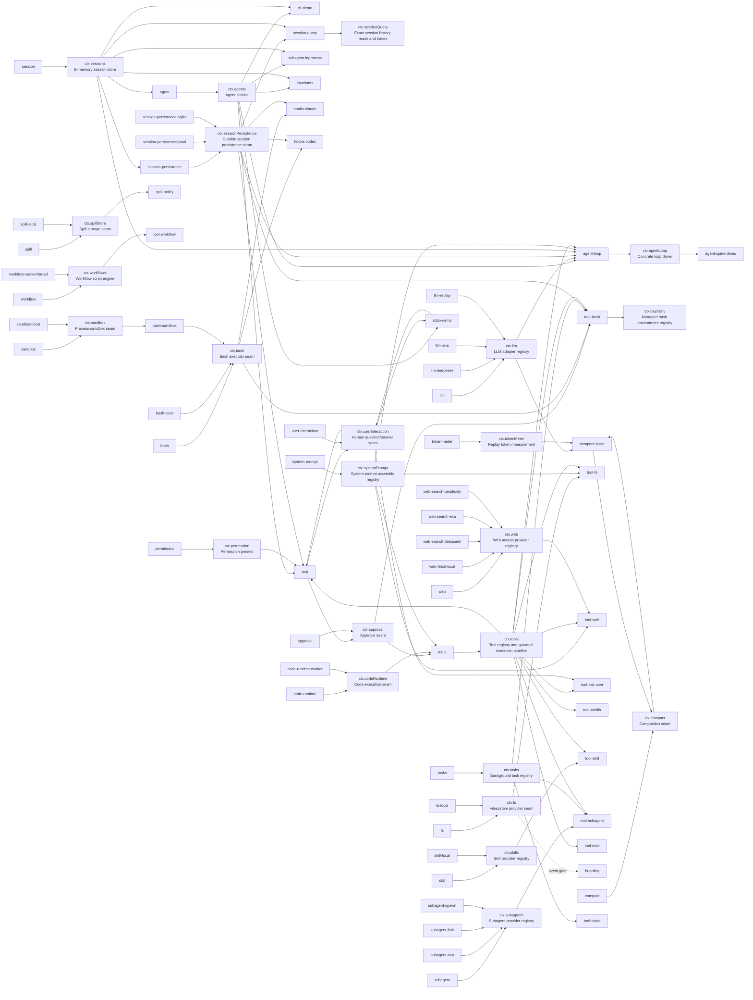

<!-- Generated by scripts/gen-doc-graphs.ts - do not edit by hand.
     Run `pnpm run gen-doc-graphs` to regenerate. -->

# Capability Seams And Core Services

A service can be a core spine service, a swappable capability seam, or a bundle/composition point. The graph shows the package that owns the service declaration, known implementation packages, and packages that consume the service directly.

| ctx key | Role | Owner | Implementations | Direct consumers | Companion plugins | Note |
| --- | --- | --- | --- | --- | --- | --- |
| `ctx.llm` | `seam` | [`llm`](../packages/llm/llm) | [`llm-deepseek`](../packages/llm/llm-deepseek), [`llm-pi-ai`](../packages/llm/llm-pi-ai), [`llm-replay`](../packages/support/llm-replay) | [`agent-loop`](../packages/core/agent-loop), [`compact-basic`](../packages/compact/compact-basic) | - | Adapters register provider implementations; the loop and compaction call the provider-neutral stream service. |
| `ctx.tokenMeter` | `core` | [`token-meter`](../packages/llm/token-meter) | - | [`compact-basic`](../packages/compact/compact-basic) | - | Owns isolated per-session replay folds; pressure consumers share immutable revisioned measurements. |
| `ctx.sessions` | `core` | [`session`](../packages/core/session) | - | [`agent-loop`](../packages/core/agent-loop), [`agent`](../packages/core/agent), [`cli-demo`](../packages/examples/cli-demo), [`session-persistence`](../packages/session-persistence/session-persistence), [`session-query`](../packages/session-query/session-query), [`subagent-inprocess`](../packages/subagent/subagent-inprocess), [`invariants`](../packages/support/invariants) | - | Owns append-only Session instances and emits the durable session event feed. |
| `ctx.sessionPersistence` | `seam` | [`session-persistence`](../packages/session-persistence/session-persistence) | [`session-persistence-jsonl`](../packages/session-persistence/session-persistence-jsonl), [`session-persistence-sqlite`](../packages/session-persistence/session-persistence-sqlite) | [`agent-loop`](../packages/core/agent-loop), [`tool-bash`](../packages/bash/tool-bash), [`hooks-claude`](../packages/hooks/hooks-claude), [`hooks-codex`](../packages/hooks/hooks-codex), [`acp`](../packages/ui/acp), [`session-query`](../packages/session-query/session-query) | - | Backends persist the same SessionEvent vocabulary; apps choose a backend at composition time. |
| `ctx.sessionQuery` | `seam` | [`session-query`](../packages/session-query/session-query) | - | - | - | Resolves live and optional persisted logs into one logical corpus for exact reads and relationship traces. |
| `ctx.systemPrompt` | `core` | [`system-prompt`](../packages/core/system-prompt) | - | [`agent-loop`](../packages/core/agent-loop), [`tools`](../packages/core/tools), [`tool-fs`](../packages/fs/tool-fs), [`tool-web`](../packages/web/tool-web) | - | Collects prompt sections and model-facing tool schemas for each step. |
| `ctx.tools` | `core` | [`tools`](../packages/core/tools) | - | [`agent-loop`](../packages/core/agent-loop), [`tool-ask-user`](../packages/ui/tool-ask-user), [`tool-bash`](../packages/bash/tool-bash), [`tool-cordis`](../packages/cordis/tool-cordis), [`tool-fs`](../packages/fs/tool-fs), [`tool-skill`](../packages/skill/tool-skill), [`tool-subagent`](../packages/subagent/tool-subagent), [`tool-todo`](../packages/todo/tool-todo), [`tool-web`](../packages/web/tool-web), [`acp`](../packages/ui/acp) | - | Registers capabilities, owns Code Mode transport, and routes calls through pre-policy, monotonic guards, around dispatch, post-policy, and final-result observation. |
| `ctx.userInteraction` | `seam` | [`user-interaction`](../packages/ui/user-interaction) | [`stdio-demo`](../packages/examples/stdio-demo), [`acp`](../packages/ui/acp) | [`tool-ask-user`](../packages/ui/tool-ask-user), [`stdio-demo`](../packages/examples/stdio-demo), [`acp`](../packages/ui/acp) | - | UI front doors provide the active human-answer provider; tool-ask-user pauses a tool call on the provider-neutral ask() promise. |
| `ctx.skills` | `seam` | [`skill`](../packages/skill/skill) | [`skill-local`](../packages/skill/skill-local) | [`tool-skill`](../packages/skill/tool-skill) | - | Merges provider skill catalogs; tool-skill renders the session-prefix catalog and loads complete skill bodies. |
| `ctx.agents` | `core` | [`agent`](../packages/core/agent) | - | [`agent-loop`](../packages/core/agent-loop), [`acp`](../packages/ui/acp), [`cli-demo`](../packages/examples/cli-demo), [`subagent-inprocess`](../packages/subagent/subagent-inprocess), [`stdio-demo`](../packages/examples/stdio-demo), [`invariants`](../packages/support/invariants) | - | Owns live Agent handles, the create/resume factory seam, and process-local initiator propagation. |
| `ctx.agentLoop` | `bundle` | [`agent-loop`](../packages/core/agent-loop) | - | [`agent-spine-demo`](../packages/examples/agent-spine-demo) | - | The one concrete loop plugin; extension packages depend on dsh-agent events and services, not on this package. |
| `ctx.bash` | `seam` | [`bash`](../packages/bash/bash) | [`bash-local`](../packages/bash/bash-local), [`bash-sandbox`](../packages/bash/bash-sandbox) | [`tool-bash`](../packages/bash/tool-bash), [`hooks-claude`](../packages/hooks/hooks-claude), [`hooks-codex`](../packages/hooks/hooks-codex) | - | The model-facing bash tools and hook bridges consume this seam; sandboxed or remote executors replace bash-local without touching them. |
| `ctx.bashEnv` | `core` | [`tool-bash`](../packages/bash/tool-bash) | - | - | - | Plugins declare effect-scoped DSH_* facts; tool-bash collects one trusted snapshot per execution and the executor rebuilds the namespace. |
| `ctx.sandbox` | `seam` | [`sandbox`](../packages/sandbox/sandbox) | [`sandbox-local`](../packages/sandbox/sandbox-local) | [`bash-sandbox`](../packages/bash/bash-sandbox) | - | Consumers hand over the exact argv they are about to spawn; same-world backends wrap it under a per-call policy and report enforcement. |
| `ctx.approval` | `seam` | `approval` | [`acp`](../packages/ui/acp) | [`tools`](../packages/core/tools), [`tool-bash`](../packages/bash/tool-bash) | - | One-shot permission decisions dispatched over the `approval/request` waterfall; answerers are listeners (the ACP bridge for its own agents), absence fails closed to `unavailable`. |
| `ctx.permission` | `core` | [`permission`](../packages/ui/permission) | - | [`acp`](../packages/ui/acp) | - | User-facing preset table (`workspace-write`/`danger-full-access`) bundling the sandbox-mode and approval-policy knobs; a switch writes one `permission/preset` event through to both knob events. |
| `ctx.codeRuntime` | `seam` | [`code-runtime`](../packages/code-runtime/code-runtime) | [`code-runtime-worker`](../packages/code-runtime/code-runtime-worker) | [`tools`](../packages/core/tools) | - | Runs one model-written program against host-provided async bindings; backends differ by substrate and language (the tool registry consumes it for Code Mode). |
| `ctx.fs` | `seam` | [`fs`](../packages/fs/fs) | [`fs-local`](../packages/fs/fs-local) | [`tool-fs`](../packages/fs/tool-fs) | [`fs-policy`](../packages/fs/fs-policy) | tool-fs executes read/write/edit through ctx.fs; fs-policy contributes observed-state checks through the fs/* event gate. |
| `ctx.compact` | `seam` | [`compact`](../packages/compact/compact) | [`compact-basic`](../packages/compact/compact-basic) | [`compact-basic`](../packages/compact/compact-basic) | - | The basic backend consumes post-step pressure and request-error recovery events; a model-facing compact tool remains deferred. |
| `ctx.subagents` | `seam` | [`subagent`](../packages/subagent/subagent) | [`subagent-spawn`](../packages/subagent/subagent-spawn), [`subagent-fork`](../packages/subagent/subagent-fork), [`subagent-acp`](../packages/subagent/subagent-acp) | [`tool-subagent`](../packages/subagent/tool-subagent) | - | Providers implement transports; tool-subagent exposes one configured provider as a model-facing tool name. |
| `ctx.tasks` | `core` | [`tasks`](../packages/tasks/tasks) | - | [`tool-bash`](../packages/bash/tool-bash), [`tool-subagent`](../packages/subagent/tool-subagent), [`tool-tasks`](../packages/tasks/tool-tasks) | - | Producers (tool-bash background commands, tool-subagent background delegations) register running work; tool-tasks is the model-facing control surface that reads, lists, and kills it. |
| `ctx.web` | `seam` | [`web`](../packages/web/web) | [`web-search-exa`](../packages/web/web-search-exa), [`web-search-perplexity`](../packages/web/web-search-perplexity), [`web-search-deepseek`](../packages/web/web-search-deepseek), [`web-fetch-local`](../packages/web/web-fetch-local) | [`tool-web`](../packages/web/tool-web) | - | Search and fetch providers register into one ctx.web seam; tool-web owns the stable model-facing names. |
| `ctx.spillStore` | `seam` | [`spill`](../packages/spill/spill) | [`spill-local`](../packages/spill/spill-local) | [`spill-policy`](../packages/spill/spill-policy) | - | The backend saves oversized tool text and returns a model-facing locator plus retrieval hint; spill-policy is the tools/post-execute consumer that decides when to spill. |
| `ctx.workflows` | `seam` | [`workflow`](../packages/workflow/workflow) | [`workflow-workerthread`](../packages/workflow/workflow-workerthread) | [`tool-workflow`](../packages/workflow/tool-workflow) | - | One engine per context (bash shape, no named-provider registry); the worker-thread engine fans agent() calls out through ctx.subagents. |

Maintenance mode: hybrid: services are discovered from Cordis declarations; interface/implementation/consumer roles are classified in `scripts/gen-doc-graphs.ts` with a completeness guard.
