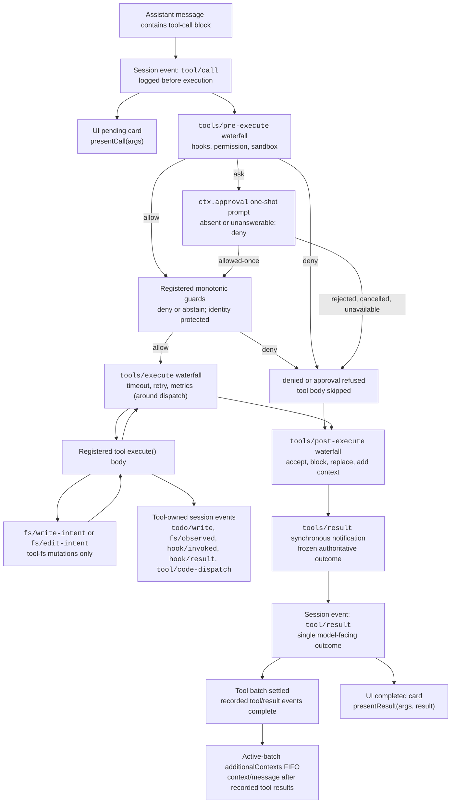

<!-- Generated by scripts/gen-doc-graphs.ts - do not edit by hand.
     Run `pnpm run gen-doc-graphs` to regenerate. -->

# Tool Execution Pipeline

This graph shows where policy, hooks, sandboxing, filesystem guards, result rewriting, final-outcome observation, and UI rendering fit without changing the loop. The transformable extension points are the `tools/pre-execute`, `tools/execute`, and `tools/post-execute` waterfalls; monotonic guards and `tools/result` are the owner-enforced boundaries around them.

Filesystem read-before-edit checks stay below `tool-fs` on `fs/*` events. Generic pre/post waterfalls host hooks and approval policy; `ctx.approval` resolves asks before monotonic guards, and owner policy that must not be reordered remains a registered guard. Around-dispatch concerns such as timeouts wrap `tools/execute`, while `tools/result` observes the immutable outcome after transforms, lossless-JSON validation, and outer error normalization. This lets hooks span tool families without coupling the tools to one policy service. Code Mode sends both the reserved `run_code` transport and its serialized sub-calls through the pipeline; sub-calls carry the parent token, log `tool/code-dispatch`, surface denials as binding rejections, and omit `additionalContexts` to preserve call/result adjacency.

Maintenance mode: curated Mermaid flow; exact tool schemas and event signatures live in generated catalogs.
