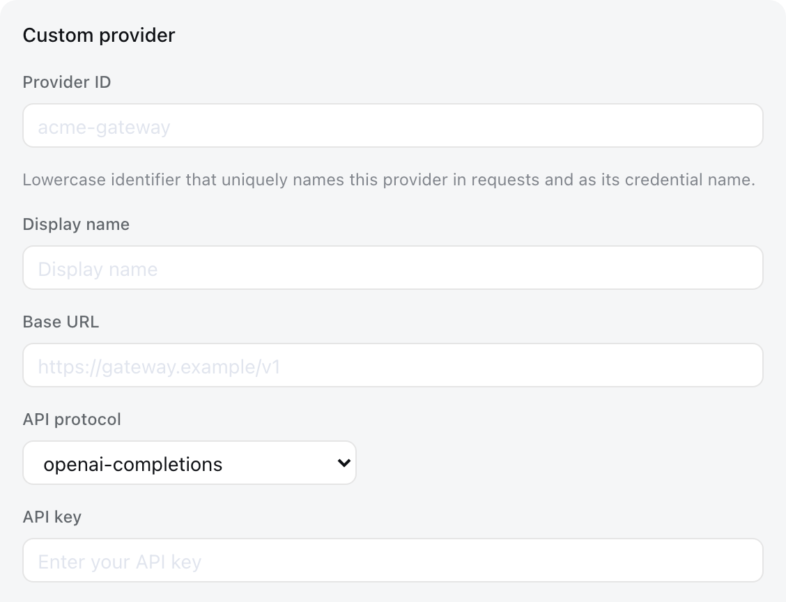

# Configure models

English | [中文](providers.zh.md)

Harness ships with DeepSeek and mounts a generic multi-provider adapter alongside it, for the providers in pi-ai's installed catalog — Anthropic, OpenAI, and the rest — and for any OpenAI-compatible gateway or self-hosted server. You have two entry points: the **Models** page in the web UI, and `$DSH_HOME/settings.yaml`. Both write the same document, and a change takes effect on the next request without a restart.

## Where providers come from

`cordis.yml` decides which **adapters** are installed; the settings document decides which **providers** run. The shipped composition carries two LLM adapters:

- `llm-deepseek` serves the `deepseek-official` route, the one available out of the box.
- `llm-pi-ai` mounts **dormant**: zero routes and no extra entries in the model picker until an `llm-pi-ai:` settings section supplies provider profiles, at which point those routes register live and drop again when the section empties.

Adding a provider therefore rarely means editing `cordis.yml` — writing settings is enough, and that is exactly what the Models page does.

## Configure from the web UI

Start `pnpm run dsh web` and open **Settings → Models**.


**Give DeepSeek its key.** The DeepSeek card carries one API-key field; fill it in, save, and the provider is ready.

**Add a provider from the installed catalog.** Choose **Add provider**, pick one of pi-ai's catalog providers (anthropic, openai, and so on), and enter that provider's API key. The endpoint, protocol, and model catalog all come from the catalog; the key is the only thing you owe.

That holds for providers that authenticate with an API key. The catalog also carries Bedrock, Vertex, Azure, and Codex, which need AWS credentials and a region, an ADC project, an `api-version`, and OAuth respectively: filling in the key field alone will not make them work. Those authenticate through pi-ai's own environment discovery, with credentials prepared the way each one requires.

**Add a custom provider.** Choose **Add a custom provider** for a route the catalog does not ship — a company gateway, a self-hosted server, or a provider newer than the installed catalog. It asks for a Provider ID (the lowercase identifier that names the route in requests and as its credential), a base URL, a protocol, and at least one model.



Every field but the Provider ID stays editable afterwards: **Edit** on the row reopens the same fields, with the display name and the protocol under 自定义设置 beside the base URL. Clearing the display name falls back to the Provider ID. The Provider ID itself is fixed: it names the route in requests, in `agent-default-model`, and in every session already logged, and it is the stem of the credential reference the page can never read back — so renaming a route means declaring a new provider and deleting the old one.

**Let the endpoint report its models.** Expand **Model catalog** and choose **Fetch available models**: the interrogation asks the endpoint **the form currently shows** — including a base URL edited but not yet saved and a key typed but not yet stored — and offers what it reports as candidates to pick from. A route the installed catalog describes is answered from that catalog with no network call. Adopting a candidate only writes rows into the draft; nothing is stored until you save.

Keys are write-only: the page only ever holds a redacted descriptor, never the literal secret. A key you enter is stored in `$DSH_HOME/.credentials.yaml`, and the profile records only the variable name that references it.

## settings.yaml for advanced configuration

The document lives at `$DSH_HOME/settings.yaml` (`$DSH_HOME` defaults to `~/.dsh`). The Models page writes this file, and you can edit it directly; neither source outranks the other.

```yaml
llm-deepseek:
  reasoningEffort: high

llm-pi-ai:
  providers:
    # Catalog route: endpoint, protocol, and models come from pi-ai; you supply
    # the credential.
    openai:
      apiKeyEnv: OPENAI_API_KEY

    # Also a catalog route, moved to a private proxy, with its catalog narrowed
    # to one model and that model's capacity corrected. Every unset field still
    # comes from the catalog.
    anthropic:
      apiKeyEnv: ANTHROPIC_API_KEY
      baseURL: https://proxy.example.com:8443
      reasoning: high
      models:
        - id: claude-sonnet-4-5
          contextWindow: 200000

    # Catalog route with one model reshaped in place; the rest of the catalog
    # keeps serving (a models list would replace it instead).
    deepseek:
      apiKeyEnv: DEEPSEEK_API_KEY
      modelOverrides:
        deepseek-v4-pro:
          reasoningEfforts:
            off:
            high: high

    # Hand-declared route: pi-ai ships nothing under this key, so the profile
    # supplies the whole provider.
    acme-gateway:
      displayName: Acme Gateway
      apiKeyEnv: ACME_GATEWAY_API_KEY
      api: openai-completions
      baseURL: https://gateway.acme.example/v1
      # Reasoning dialect for an endpoint whose URL pi-ai cannot recognize.
      compat:
        thinkingFormat: deepseek
      models:
        - id: acme-large
          name: Acme Large
          contextWindow: 65536
          maxTokens: 4096
        - id: acme-think
          name: Acme Think
          # key = level offered in the picker, value = what goes on the wire;
          # only off may leave the value empty (supported, send nothing).
          reasoningEfforts:
            off:
            high: high
            max: ultra
```

A settings section merges over the matching `cordis.yml` configuration **per provider**, so you can override one field of one route and leave the rest as the composition set them.

A profile the adapter could not serve is refused **where it is written**: a hand-declared route needs `api`, `baseURL`, and at least one model, and a profile missing any of them fails naming the offending route and model rather than being stored and quietly disabling the whole namespace. When an already-stored document is broken by an external edit, settings keeps the last good value and warns.

## The model catalog

A profile's `models` list *replaces* that route's installed catalog rather than extending it; omitting it or leaving it empty serves the catalog unchanged. Each entry defaults its unset fields from the installed model of the same `id`, so narrowing a route to two models, correcting one capacity, or adding a model newer than the installed catalog are each a one-line edit — but once you declare the list, every model the route should keep serving must appear in it, an entry of nothing but `id` being enough.

Reshaping a few catalog models while keeping the rest is `modelOverrides`' job: it is keyed by catalog model id, takes the same fields a `models` entry does, and leaves the rest of the catalog serving untouched. An override naming a model the catalog does not describe — or set beside a `models` list, or on a custom provider — is refused rather than silently skipped.

The configurable model fields are `id`, `name`, `contextWindow`, `maxTokens`, `reasoningEfforts`, and `compat`. Pricing and input modalities have no consumer and ride the installed entry.

**Declare reasoning levels per model.** `reasoningEfforts` lists the levels a model offers: each key appears in the composer's effort picker, and its value is what dispatch sends on the wire — `high: high` passes the name through, `max: ultra` renames it for a gateway with its own vocabulary. A level you leave out is not offered. `off` is special: declared without a value, Off appears in the picker and selecting it sends nothing; left out entirely, the picker offers no Off and requests carry no off switch — the provider's own default decides. `reasoningEfforts: false` declares a non-reasoning model, which is also how you strip reasoning from a catalog model your gateway cannot serve. Without this field a custom model does not reason and a catalog model keeps its catalog levels.

**Pick the reasoning dialect.** How a level travels — plain `reasoning_effort`, DeepSeek's `thinking: {type}` plus effort, and so on — is normally guessed from the endpoint URL, and a private gateway's URL says nothing, so a DeepSeek-style gateway would be spoken to in the OpenAI dialect. `compat.thinkingFormat` sets the dialect explicitly, and `compat.supportsReasoningEffort: false` holds the parameter back from an endpoint that rejects it; both work on the route (its models' default) or per model, for `openai-completions` routes only.

A model neither the entry nor the catalog sizes takes the route's `defaultContextWindow` (262,144) and `defaultMaxTokens` (32,768). Both are guesses by construction, which is why they are route fields: a deployment whose gateway serves smaller models corrects them once.

Model ids are not lifecycle configuration. Requesting a model the route does not configure fails with `UNKNOWN_MODEL` before any provider request goes out.

## Credentials

Use `apiKeyEnv`: it is a *reference* resolved per request, so no secret enters the configuration file. Omitting it leaves a route unauthenticated, which for a catalog route means pi-ai's own environment discovery. A reference that resolves to nothing fails the request with `MISSING_CREDENTIAL` rather than falling through to whatever unrelated key the environment happens to hold.

Under `dsh`, references resolve from the inherited environment, the Models page's `$DSH_HOME/.credentials.yaml` store, the invoking directory's `.env`, then `$DSH_HOME/.env`. Without a credential service, a reference reads only the matching environment variable. One credential serves every model on its route.

## Point an agent at the new provider

A configured route appears in the web model picker and can be switched at any time.

Switching there also sets the default: the model you pick becomes the one the next new session starts on, recorded in `settings.yaml` under `agent-default-model`. There is no separate gesture.

```yaml
agent-default-model:
  provider: acme-gateway
  model: acme-large
  reasoningEffort: high   # optional
```

After a session has run a turn, its own log remains authoritative for its model selection; the default applies only to sessions without a recorded request. The shipped fallback under this section is the base bundle's `agent-default-model` composition entry (`deepseek-official` / `deepseek-v4-flash`). A self-assembled `cordis.yml` mounts and configures `@deepseek-ai/dsh-agent-default-model`; both direct entry points and Host-backed entry points read that same service.

If the provider a saved default names is later removed, the composer says **Select model** and refuses input until you pick one, rather than sending to a route nothing serves.

## Troubleshooting

- **`MISSING_CREDENTIAL`** — the variable the profile's `apiKeyEnv` names holds no value. Store the key once through the Models page, or export the variable.
- **`UNKNOWN_MODEL`** — the requested model is not in the route's configured catalog. Add it to `models`, or use an id the catalog already carries.
- **`UNSUPPORTED_REASONING_EFFORT`** — the request asked the model for a level it does not offer. Pick a level the composer lists for that model, or declare the missing one in the model's `reasoningEfforts`.
- **`settings-rejected`** — the written profile cannot be served, and the message names the route and model. For a hand-declared route, check that `api`, `baseURL`, and `models` are all present.
- **Fetching available models answers 401** — the endpoint refused the interrogation. Check the key; if the base URL points at an Anthropic-style gateway, note that the interrogation reads only the OpenAI-compatible `GET /models`, so enter the models by hand instead.

## Exact field reference

The complete fields, types, and defaults each plugin currently supports live in the generated [plugin configuration catalog](../../config-catalog.md). Each adapter's own semantics belong to its README: [`dsh-llm-pi-ai`](../../../packages/llm/llm-pi-ai/README.md) and [`dsh-llm-deepseek`](../../../packages/llm/llm-deepseek/README.md). For `cordis.yml` itself, see [Configuration](./config.md).
