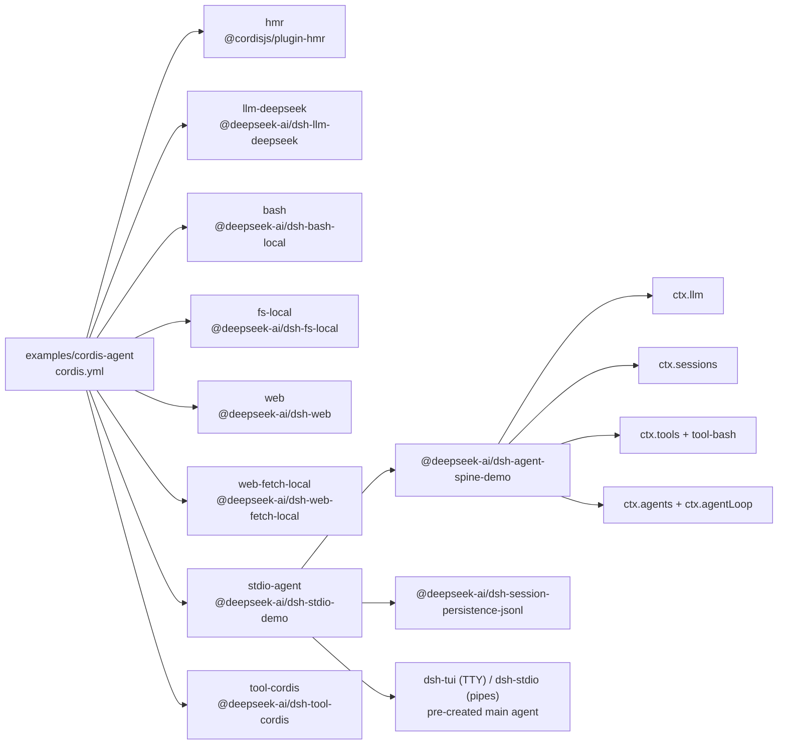

<!-- Generated by scripts/gen-doc-graphs.ts - do not edit by hand.
     Run `pnpm run gen-doc-graphs` to regenerate. -->

# Cordis Agent App Composition

The self-referential demo puts @deepseek-ai/dsh-tool-cordis on the coding spine, letting the agent inspect its own runtime and mount/unmount plugins into it.

| Plugin id | Package / module |
| --- | --- |
| `hmr` | `@cordisjs/plugin-hmr` |
| `llm-deepseek` | `@deepseek-ai/dsh-llm-deepseek` |
| `bash` | `@deepseek-ai/dsh-bash-local` |
| `fs-local` | `@deepseek-ai/dsh-fs-local` |
| `web` | `@deepseek-ai/dsh-web` |
| `web-fetch-local` | `@deepseek-ai/dsh-web-fetch-local` |
| `stdio-agent` | `@deepseek-ai/dsh-stdio-demo` |
| `tool-cordis` | `@deepseek-ai/dsh-tool-cordis` |

Source config: [`examples/cordis-agent/cordis.yml`](cordis.yml).

Maintenance mode: hybrid: the leaf plugin list is parsed from its `cordis.yml`; app package expansion is curated from package source.
