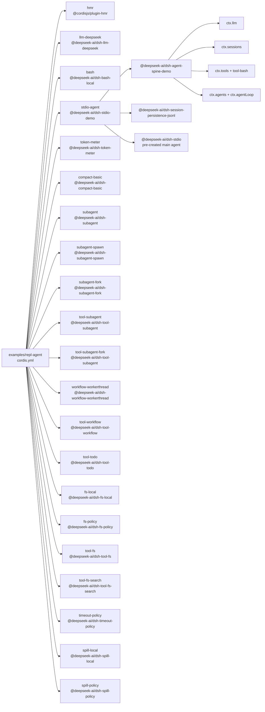

<!-- Generated by scripts/gen-doc-graphs.ts - do not edit by hand.
     Run `pnpm run gen-doc-graphs` to regenerate. -->

# REPL Agent App Composition

The REPL agent demo adds the real DeepSeek adapter, filesystem tools, todo_write, compaction, and both subagent transports on top of the stdio app package.

| Plugin id | Package / module |
| --- | --- |
| `hmr` | `@cordisjs/plugin-hmr` |
| `llm-deepseek` | `@deepseek-ai/dsh-llm-deepseek` |
| `bash` | `@deepseek-ai/dsh-bash-local` |
| `stdio-agent` | `@deepseek-ai/dsh-stdio-demo` |
| `token-meter` | `@deepseek-ai/dsh-token-meter` |
| `compact-basic` | `@deepseek-ai/dsh-compact-basic` |
| `subagent` | `@deepseek-ai/dsh-subagent` |
| `subagent-spawn` | `@deepseek-ai/dsh-subagent-spawn` |
| `subagent-fork` | `@deepseek-ai/dsh-subagent-fork` |
| `tool-subagent` | `@deepseek-ai/dsh-tool-subagent` |
| `tool-subagent-fork` | `@deepseek-ai/dsh-tool-subagent` |
| `workflow-workerthread` | `@deepseek-ai/dsh-workflow-workerthread` |
| `tool-workflow` | `@deepseek-ai/dsh-tool-workflow` |
| `tool-todo` | `@deepseek-ai/dsh-tool-todo` |
| `fs-local` | `@deepseek-ai/dsh-fs-local` |
| `fs-policy` | `@deepseek-ai/dsh-fs-policy` |
| `tool-fs` | `@deepseek-ai/dsh-tool-fs` |
| `tool-fs-search` | `@deepseek-ai/dsh-tool-fs-search` |
| `timeout-policy` | `@deepseek-ai/dsh-timeout-policy` |
| `spill-local` | `@deepseek-ai/dsh-spill-local` |
| `spill-policy` | `@deepseek-ai/dsh-spill-policy` |

Source config: [`examples/repl-agent/cordis.yml`](cordis.yml).

Maintenance mode: hybrid: the leaf plugin list is parsed from its `cordis.yml`; app package expansion is curated from package source.
