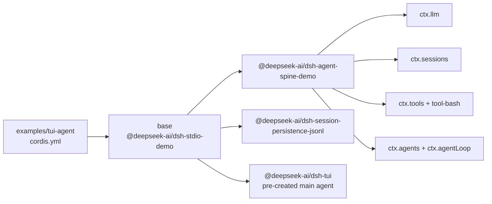

<!-- Generated by scripts/gen-doc-graphs.ts - do not edit by hand.
     Run `pnpm run gen-doc-graphs` to regenerate. -->

# TUI Agent App Composition

The TUI agent reuses the repl-agent backend and tool composition while fixing the shared terminal app to the full-screen dsh-tui front door.

| Plugin id | Package / module |
| --- | --- |
| `base` | `@deepseek-ai/dsh-stdio-demo` |

Source config: [`examples/tui-agent/cordis.yml`](cordis.yml).

Maintenance mode: hybrid: the leaf plugin list is parsed from its `cordis.yml`; app package expansion is curated from package source.
