<!-- Generated by scripts/gen-doc-graphs.ts - do not edit by hand.
     Run `pnpm run gen-doc-graphs` to regenerate. -->

# TUI Agent App Composition

The TUI agent combines the real DeepSeek adapter, coding tools, compaction, subagents, and workflows with the full-screen terminal app package.

```mermaid
flowchart LR
  cfg["examples/tui-agent<br/>cordis.yml"]
  plugin_tui_hmr["hmr<br/>@cordisjs/plugin-hmr"]
  cfg --> plugin_tui_hmr
  plugin_tui_llm_deepseek["llm-deepseek<br/>@deepseek-ai/dsh-llm-deepseek"]
  cfg --> plugin_tui_llm_deepseek
  plugin_tui_subprocess["subprocess<br/>@deepseek-ai/dsh-subprocess-local"]
  cfg --> plugin_tui_subprocess
  plugin_tui_bash["bash<br/>@deepseek-ai/dsh-bash-local"]
  cfg --> plugin_tui_bash
  plugin_tui_tui_agent["tui-agent<br/>@deepseek-ai/dsh-tui-demo"]
  cfg --> plugin_tui_tui_agent
  plugin_tui_tui_agent --> bundle_agent_core["@deepseek-ai/dsh-agent-spine-demo"]
  plugin_tui_tui_agent --> bundle_jsonl["@deepseek-ai/dsh-session-persistence-jsonl"]
  plugin_tui_tui_agent --> frontdoor_tui["@deepseek-ai/dsh-tui<br/>pre-created main agent"]
  bundle_agent_core --> spine_llm["ctx.llm"]
  bundle_agent_core --> spine_sessions["ctx.sessions"]
  bundle_agent_core --> spine_tools["ctx.tools + tool-bash"]
  bundle_agent_core --> spine_loop["ctx.agents + ctx.agentLoop"]
  plugin_tui_session_title_llm["session-title-llm<br/>@deepseek-ai/dsh-session-title-first-message-llm"]
  cfg --> plugin_tui_session_title_llm
  plugin_tui_token_meter["token-meter<br/>@deepseek-ai/dsh-token-meter"]
  cfg --> plugin_tui_token_meter
  plugin_tui_tool_result_prune["tool-result-prune<br/>@deepseek-ai/dsh-compact-tool-result-prune"]
  cfg --> plugin_tui_tool_result_prune
  plugin_tui_compact_basic["compact-basic<br/>@deepseek-ai/dsh-compact-basic"]
  cfg --> plugin_tui_compact_basic
  plugin_tui_subagent["subagent<br/>@deepseek-ai/dsh-subagent"]
  cfg --> plugin_tui_subagent
  plugin_tui_subagent_spawn["subagent-spawn<br/>@deepseek-ai/dsh-subagent-spawn"]
  cfg --> plugin_tui_subagent_spawn
  plugin_tui_subagent_fork["subagent-fork<br/>@deepseek-ai/dsh-subagent-fork"]
  cfg --> plugin_tui_subagent_fork
  plugin_tui_tool_subagent["tool-subagent<br/>@deepseek-ai/dsh-tool-subagent"]
  cfg --> plugin_tui_tool_subagent
  plugin_tui_tool_subagent_fork["tool-subagent-fork<br/>@deepseek-ai/dsh-tool-subagent"]
  cfg --> plugin_tui_tool_subagent_fork
  plugin_tui_workflow_workerthread["workflow-workerthread<br/>@deepseek-ai/dsh-workflow-workerthread"]
  cfg --> plugin_tui_workflow_workerthread
  plugin_tui_tool_workflow["tool-workflow<br/>@deepseek-ai/dsh-tool-workflow"]
  cfg --> plugin_tui_tool_workflow
  plugin_tui_tool_ralph["tool-ralph<br/>@deepseek-ai/dsh-tool-ralph"]
  cfg --> plugin_tui_tool_ralph
  plugin_tui_plan_mode["plan-mode<br/>@deepseek-ai/dsh-plan-mode"]
  cfg --> plugin_tui_plan_mode
  plugin_tui_fs_local["fs-local<br/>@deepseek-ai/dsh-fs-local"]
  cfg --> plugin_tui_fs_local
  plugin_tui_fs_policy["fs-policy<br/>@deepseek-ai/dsh-fs-policy"]
  cfg --> plugin_tui_fs_policy
  plugin_tui_tool_fs["tool-fs<br/>@deepseek-ai/dsh-tool-fs"]
  cfg --> plugin_tui_tool_fs
  plugin_tui_tool_fs_search["tool-fs-search<br/>@deepseek-ai/dsh-tool-fs-search"]
  cfg --> plugin_tui_tool_fs_search
  plugin_tui_timeout_policy["timeout-policy<br/>@deepseek-ai/dsh-timeout-policy"]
  cfg --> plugin_tui_timeout_policy
  plugin_tui_spill_local["spill-local<br/>@deepseek-ai/dsh-spill-local"]
  cfg --> plugin_tui_spill_local
  plugin_tui_spill_policy["spill-policy<br/>@deepseek-ai/dsh-spill-policy"]
  cfg --> plugin_tui_spill_policy
```

| Plugin id | Package / module |
| --- | --- |
| `hmr` | `@cordisjs/plugin-hmr` |
| `llm-deepseek` | `@deepseek-ai/dsh-llm-deepseek` |
| `subprocess` | `@deepseek-ai/dsh-subprocess-local` |
| `bash` | `@deepseek-ai/dsh-bash-local` |
| `tui-agent` | `@deepseek-ai/dsh-tui-demo` |
| `session-title-llm` | `@deepseek-ai/dsh-session-title-first-message-llm` |
| `token-meter` | `@deepseek-ai/dsh-token-meter` |
| `tool-result-prune` | `@deepseek-ai/dsh-compact-tool-result-prune` |
| `compact-basic` | `@deepseek-ai/dsh-compact-basic` |
| `subagent` | `@deepseek-ai/dsh-subagent` |
| `subagent-spawn` | `@deepseek-ai/dsh-subagent-spawn` |
| `subagent-fork` | `@deepseek-ai/dsh-subagent-fork` |
| `tool-subagent` | `@deepseek-ai/dsh-tool-subagent` |
| `tool-subagent-fork` | `@deepseek-ai/dsh-tool-subagent` |
| `workflow-workerthread` | `@deepseek-ai/dsh-workflow-workerthread` |
| `tool-workflow` | `@deepseek-ai/dsh-tool-workflow` |
| `tool-ralph` | `@deepseek-ai/dsh-tool-ralph` |
| `plan-mode` | `@deepseek-ai/dsh-plan-mode` |
| `fs-local` | `@deepseek-ai/dsh-fs-local` |
| `fs-policy` | `@deepseek-ai/dsh-fs-policy` |
| `tool-fs` | `@deepseek-ai/dsh-tool-fs` |
| `tool-fs-search` | `@deepseek-ai/dsh-tool-fs-search` |
| `timeout-policy` | `@deepseek-ai/dsh-timeout-policy` |
| `spill-local` | `@deepseek-ai/dsh-spill-local` |
| `spill-policy` | `@deepseek-ai/dsh-spill-policy` |

Source config: [`examples/tui-agent/cordis.yml`](cordis.yml).

Maintenance mode: hybrid: the leaf plugin list is parsed from its `cordis.yml`; app package expansion is curated from package source.
