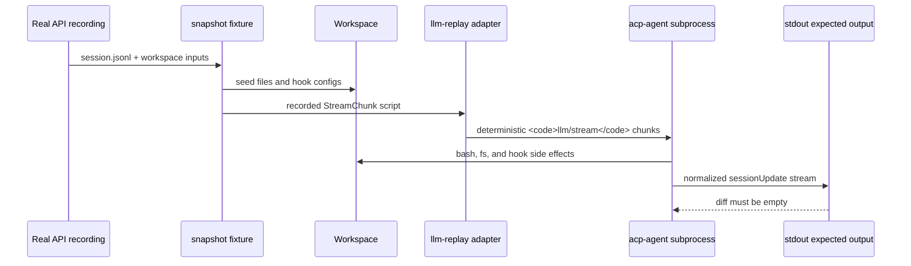

<!-- Generated by scripts/gen-doc-graphs.ts - do not edit by hand.
     Run `pnpm run gen-doc-graphs` to regenerate. -->

# ACP Snapshot Replay

This graph explains what a snapshot scenario proves: recorded real-model session logs are replayed keylessly, ACP stdout is normalized and diffed, and scenario workspaces preserve tool side effects that the UI stream alone cannot prove.

The fs and hook snapshot matrix is valuable because it proves world state, hook decisions, and failed tool-card rendering, not just that replay returns text.

Maintenance mode: curated Mermaid sequence based on the snapshot test harness.
